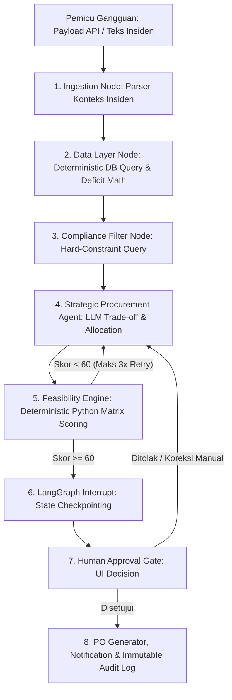

# PRODUCT REQUIREMENTS DOCUMENT (PRD)

**Nama Produk:** ResilioAI: Hybrid Multi-Agent & Deterministic Pipeline for Supply Chain Resilience
**Kategori Lomba:** AI Agent Development – GTNIC 2026
**Sub-Tema:** Building Intelligent AI Agents for Enterprise Productivity
**Studi Kasus:** Satuan Pelayanan Pemenuhan Gizi (SPPG) / Program Pemenuhan Makanan Skala Besar
**Arsitektur:** Hybrid Decoupled Architecture (Backend: Python FastAPI + LangGraph Hybrid Engine | Frontend: Next.js + Tailwind / Shadcn UI)

---

## 1. Latar Belakang & Pernyataan Masalah

### 1.1 Konteks Industri
Satuan Pelayanan Pemenuhan Gizi (SPPG) memproduksi makanan dalam skala ribuan porsi per hari secara terjadwal. Operasional ini bergantung pada pasokan bahan pangan segar (*perishable goods*) dengan batas toleransi waktu (*lead time*) yang ketat, kepatuhan sertifikasi halal yang tidak bisa dikompromi, serta batasan fisik kapasitas penyimpanan (*freezer/chiller*).

### 1.2 Masalah Operasional Riil
1. **Kerapuhan Rantai Pasok:** Pembatalan sepihak atau keterlambatan supplier utama akibat cuaca ekstrem/bencana mengancam kegagalan jadwal masak harian.
2. **Mitigasi Manual yang Lambat:** Proses mitigasi konvensional memakan waktu 4–6 jam melalui komunikasi manual (telepon/WhatsApp).
3. **Risiko Halusinasi & Ketidakpatuhan AI Murni:** Menyerahkan kalkulasi stok, batasan anggaran, dan audit kepatuhan halal sepenuhnya kepada Large Language Model (LLM) berisiko tinggi menghasilkan halusinasi data numerik, waktu eksekusi lambat (>30 detik), dan ketiadaan konsistensi matematis yang dapat diaudit.

### 1.3 Solusi ResilioAI: Pendekatan Hibrida (Deterministic + LLM)
ResilioAI menggabungkan kecepatan serta presisi **Deterministic Pipeline** (pengambilan data database, kalkulasi defisit kuantitas, pemfilteran syarat mutlak/hard-constraints, dan formula skoring) dengan fleksibilitas kognitif **LLM Agent** (ekstraksi konteks insiden tak terstruktur, perumusan strategi mitigasi *split-delivery*, dan penyusunan narasi justifikasi untuk pengambil keputusan).

---

## 2. Profil Pengguna (User Persona)

- **Petugas Logistik / Pengadaan SPPG:** Membutuhkan sistem yang mendeteksi risiko defisit bahan secara instan dan menyediakan opsi supplier pengganti tervalidasi.
- **Kepala SPPG / Manajer Operasional (Approver):** Bertanggung jawab atas ketersediaan menu harian dan memiliki wewenang hukum menyetujui pengadaan darurat (*Human-in-the-Loop Gate*).
- **Auditor Internal & Kepatuhan:** Membutuhkan rekam jejak keputusan (*audit trail*) matematis yang transparan dan dapat direproduksi untuk membuktikan legalitas serta kepatuhan sertifikasi Halal.

---

## 3. Arsitektur Sistem & Spesifikasi Pipeline

Sistem menggunakan alur kerja **Hybrid Cyclic StateGraph** berbasis **LangGraph** dengan persistensi state terintegrasi.



### 3.1 Pemisahan Peran: Deterministic Nodes vs LLM Nodes

| Komponen / Node | Jenis Eksekusi | Deskripsi & Tanggung Jawab | Alasan Desain Industri |
| :--- | :--- | :--- | :--- |
| **1. Ingestion Node** | Hybrid (Rule + LLM fallback) | Membaca muatan insiden terstruktur atau mengekstrak variabel insiden dari teks laporan bebas. | Fleksibel terhadap input teks bebas tanpa mengorbankan skema data. |
| **2. Data Layer Node** | **Pure Deterministic (Python/ORM)** | - Kueri stok aktual gudang.<br>- Kueri sisa kapasitas *chiller/freezer*.<br>- Ambil data kebutuhan menu harian.<br>- Hitung defisit: $\text{Defisit} = (\text{Kebutuhan} \times 1.2) - \text{Stok}$. | **Zero Hallucination.** Aritmatika dan kueri database wajib 100% presisi dan tidak boleh ditebak oleh LLM. |
| **3. Hard-Constraint Filter** | **Pure Deterministic (SQL Filter)** | Memfilter katalog supplier rekanan: hanya yang memiliki status sertifikat Halal aktif dan beroperasi dalam radius toleransi logistik. | Regulasi Halal dan legalitas adalah syarat mutlak (*zero tolerance*). |
| **4. Strategic Procurement Agent** | **LLM (Cognitive Reasoning)** | - Menimbang *trade-off* antar kandidat supplier tervalidasi.<br>- Menyusun skema logistik (apakah butuh *split-delivery* jika freezer terbatas).<br>- Menghasilkan narasi justifikasi rekomendasi. | LLM unggul dalam penalaran strategis, pemecahan skenario fleksibel, dan penyusunan narasi manusiawi. |
| **5. Feasibility Scoring Engine** | **Pure Deterministic (Python Function)** | Mengkalkulasi formula matematis skoring 7 parameter berbobot untuk memvalidasi kelayakan strategi supplier. | Memastikan skor kelayakan dapat diaudit secara konsisten oleh auditor eksternal. |
| **6. Checkpoint & HITL Gate** | **LangGraph Checkpointer** | Menahan eksekusi alur kerja (*interrupt*), menyimpan snapshot state ke database (SQLite/PostgreSQL), menunggu aksi otorisasi manusia. | Data state tidak hilang saat server restart atau proses asinkron menunggu berjam-jam. |
| **7. PO & Audit Generator** | **Pure Deterministic (Python Service)** | Menerbitkan nomor PO resmi, mencatat audit log tak terhapuskan (*append-only*), dan memicu webhook/notifikasi. | Integritas transaksi finansial dan hukum. |

---

### 3.2 Model Skoring Kelayakan Deterministik (Feasibility Gate)

Kalkulasi skoring dilakukan oleh fungsi deterministik Python dengan bobot terukur:

$$\text{Total Score} = \sum_{i=1}^{7} (W_i \times S_i)$$

1. **Ketersediaan & Pemenuhan Kuota ($W_1 = 25\%$):** Rasio kuota supplier terhadap defisit.
2. **Estimasi Waktu Tiba vs Jam Masak ($W_2 = 20\%$):** Margin waktu antara estimasi kedatangan bahan dan dimulainya proses produksi dapur.
3. **Kepatuhan Anggaran / Budget Compliance ($W_3 = 15\%$):** Deviasi harga penawaran terhadap pagu anggaran SOP.
4. **Legalitas & Sertifikasi Halal ($W_4 = 15\%$):** *Gating parameter* (Wajib bernilai 100, jika 0 maka total skor langsung 0).
5. **Kesesuaian Kapasitas Penyimpanan / Freezer ($W_5 = 10\%$):** Rasio volume pengiriman batch pertama terhadap sisa ruang simpan dingin.
6. **Kapasitas Olah Dapur ($W_6 = 10\%$):** Kesiapan personel dan peralatan menerima bahan mentah pada jam tiba.
7. **Risiko Rute Distribusi ($W_7 = 5\%$):** Evaluasi jalur pengiriman dari titik supplier ke SPPG.

**Kriteria Keputusan:**
- $\ge 80$: **FEASIBLE** (Lolos penuh, langsung direkomendasikan).
- $60 - 79$: **FEASIBLE WITH CONDITIONS** (Lolos bersyarat, mewajibkan klausul pengiriman terbagi / *split delivery*).
- $< 60$: **NOT FEASIBLE** (Ditolak oleh engine, memicu siklus perulangan / *retry* untuk mengevaluasi opsi supplier alternatif lain, maksimal 3x).

---

## 4. Kebutuhan Fungsional (Functional Requirements)

### 4.1 Backend (Python FastAPI + LangGraph)

- **FR-BE-01 (Incident Ingestion Endpoint):** Menerima event gangguan rantai pasok baik berupa payload JSON terstruktur maupun teks laporan lapangan.
- **FR-BE-02 (Deterministic Data Extraction):** Mengambil data inventaris gudang, master menu, dan katalog supplier rekanan melalui lapisan akses data (ORM/parameterized SQL) tanpa keterlibatan LLM pada kueri basis data.
- **FR-BE-03 (Strategic Agent Reasoning):** Menggunakan LLM dengan *structured output* (Pydantic) untuk menghasilkan alokasi pengadaan, evaluasi risiko logistik, dan alasan pemilihan supplier.
- **FR-BE-04 (Deterministic Feasibility Verification):** Memvalidasi rencana pengadaan dari agent menggunakan fungsi kalkulasi skoring matematis tertutup sebelum disajikan ke pengguna.
- **FR-BE-05 (Server-Sent Events Streaming):** Menyediakan rute streaming (`GET /api/v1/incidents/{incident_id}/stream`) untuk mentransmisikan status eksekusi tiap node LangGraph secara *real-time* ke antarmuka pengguna.
- **FR-BE-06 (Persistent State Checkpointing & HITL):** Menerapkan mekanisme `interrupt` LangGraph dengan database checkpointer persisten sehingga state tetap aman saat menunggu persetujuan manusia.
- **FR-BE-07 (Purchase Order & Immutable Audit Trail):** Memproduksi dokumen draf PO resmi dan mencatat seluruh rantai keputusan ke dalam tabel audit log yang bersifat *append-only*.

### 4.2 Frontend (Next.js + Tailwind CSS / Shadcn UI)

- **FR-FE-01 (Incident Simulation & Control Center):** Antarmuka pengguna untuk memicu simulasi gangguan rantai pasok (misal: "Banjir Supplier Ayam Utama") dan memantau status operasional SPPG.
- **FR-FE-02 (Real-time Pipeline Visualizer):** Komponen visual interaktif yang menampilkan perpindahan status antar-node secara *real-time* memanfaatkan transmisi SSE backend.
- **FR-FE-03 (Feasibility Matrix Card):** Menampilkan perbandingan supplier, rincian skor 7 parameter, peringatan kendala fisik (*freezer capacity*), dan rekomendasi strategi logistik.
- **FR-FE-04 (Human Approval Modal):** Kotak dialog persetujuan bagi Kepala SPPG untuk meninjau rekomendasi, mengubah alokasi jumlah jika diperlukan, serta melakukan aksi *Approve* atau *Reject*.
- **FR-FE-05 (Purchase Order & Audit Trail Viewer):** Halaman riwayat untuk melihat dan mengunduh berkas PO yang telah disetujui beserta ringkasan log audit yang mendasari keputusannya.

---

## 5. Kebutuhan Non-Fungsional (Non-Functional Requirements)

- **NFR-01 (Latensi & Efisiensi):** Dengan memindahkan kueri data dan skoring ke alur deterministik, eksekusi alur kerja dari pemicu insiden hingga munculnya kartu rekomendasi di layar wajib selesai dalam waktu **$\le 6$ detik** (turun drastis dari estimasi alur multi-LLM murni yang memakan >30 detik).
- **NFR-02 (Ketahanan State & Toleransi Kegagalan):** State sistem wajib disimpan pada checkpointer persisten (SQLite/PostgreSQL). Jika backend dimuat ulang (*restart*) saat menunggu keputusan persetujuan, sesi tidak boleh hilang.
- **NFR-03 (Integritas Tipe Data & Skema):** Seluruh pertukaran data antar-node LangGraph, endpoint FastAPI, dan frontend Next.js wajib divalidasi menggunakan skema Pydantic v2 di backend dan antarmuka TypeScript di frontend.
- **NFR-04 (Keamanan & Isolasi Database):** LLM tidak memiliki akses langsung ke koneksi database driver. Seluruh interaksi database dilakukan melalui kueri berparameter (*parameterized query*) untuk mengeliminasi celah SQL Injection. Kunci API LLM tersimpan eksklusif di environment backend.

---

## 6. Desain Alur Data & Kontrak API (API Contracts)

### 6.1 `POST /api/v1/incidents/trigger`
Memicu alur pipeline mitigasi rantai pasok.

**Request Payload:**
```json
{
  "item_id": "ITEM-AYAM-01",
  "disruption_type": "SUPPLIER_DISRUPTION",
  "affected_supplier_id": "SUP-UTAMA-01",
  "estimated_duration_days": 3,
  "incident_notes": "Armada supplier utama terjebak banjir di jalur logistik Pantura."
}
```

**Response Body (Synchronous Ack):**
```json
{
  "incident_id": "INC-2026-001",
  "status": "PROCESSING",
  "stream_url": "/api/v1/incidents/INC-2026-001/stream"
}
```

---

### 6.2 `GET /api/v1/incidents/{incident_id}/stream` (Server-Sent Events)
Streaming status eksekusi tiap node LangGraph secara *real-time* ke frontend.

**Event Stream Payloads:**
```text
event: node_started
data: {"node": "deterministic_data_layer", "timestamp": "2026-10-04T10:00:01Z"}

event: node_completed
data: {"node": "deterministic_data_layer", "deficit_kg": 64.0, "current_stock_kg": 80.0, "freezer_remaining_kg": 20.0}

event: node_started
data: {"node": "strategic_procurement_agent", "model": "gemini-2.5-flash"}

event: node_completed
data: {"node": "feasibility_scoring_engine", "score": 78.5, "status": "FEASIBLE_WITH_CONDITIONS"}

event: workflow_waiting_approval
data: {"incident_id": "INC-2026-001", "decision_ready": true}
```

---

### 6.3 `GET /api/v1/incidents/{incident_id}/decision`
Mengambil detail keputusan lengkap saat alur berada pada gerbang *Human Approval Gate*.

**Response Body:**
```json
{
  "incident_id": "INC-2026-001",
  "item_id": "ITEM-AYAM-01",
  "item_name": "Daging Ayam Broiler Segar",
  "metrics": {
    "current_stock_kg": 80.0,
    "deficit_kg": 64.0,
    "freezer_available_kg": 20.0,
    "target_production_portions": 3000
  },
  "recommended_procurement": {
    "supplier_id": "SUP-ALT-02",
    "supplier_name": "PT Berkah Unggas Jaya",
    "unit_price_idr": 38000,
    "total_estimated_cost_idr": 2432000,
    "halal_certificate_active": true,
    "feasibility_score": 78.5,
    "feasibility_status": "FEASIBLE_WITH_CONDITIONS",
    "scoring_breakdown": {
      "stock_fulfillment": 100.0,
      "time_lead_compliance": 85.0,
      "budget_compliance": 90.0,
      "halal_and_legal": 100.0,
      "storage_compatibility": 40.0,
      "kitchen_capacity": 80.0,
      "route_safety": 70.0
    },
    "logistics_strategy": {
      "strategy_type": "SPLIT_DELIVERY",
      "rationale": "Kapasitas freezer hanya 20 kg. Batch 1 (20 kg) tiba H-1 jam 17:00 WIB untuk persiapan malam, Batch 2 (44 kg) tiba Hari-H jam 05:00 WIB langsung masuk proses masak pagi.",
      "batches": [
        {"batch_no": 1, "qty_kg": 20.0, "eta": "2026-10-04T17:00:00Z"},
        {"batch_no": 2, "qty_kg": 44.0, "eta": "2026-10-05T05:00:00Z"}
      ]
    }
  },
  "audit_trail": [
    {"stage": "DATA_AGGREGATION", "status": "DETERMINISTIC_PASS", "message": "Stok gudang dan defisit dihitung dari basis data aktif."},
    {"stage": "COMPLIANCE_FILTER", "status": "DETERMINISTIC_PASS", "message": "Supplier non-halal dieliminasi dari daftar pencarian."},
    {"stage": "STRATEGY_SYNTHESIS", "status": "AGENT_REASONING_PASS", "message": "Agen menyusun mitigasi split delivery untuk mengatasi restriksi freezer."},
    {"stage": "FEASIBILITY_GATE", "status": "VERIFIED", "message": "Skor kelayakan 78.5/100 dihitung secara deterministik."}
  ]
}
```

---

### 6.4 `POST /api/v1/incidents/{incident_id}/approve`
Mengeksekusi otorisasi persetujuan dari Kepala SPPG dan meresume alur LangGraph.

**Request Payload:**
```json
{
  "incident_id": "INC-2026-001",
  "action": "APPROVE",
  "approved_qty_kg": 64.0,
  "approver_name": "Budi Santoso (Kepala SPPG)",
  "approver_notes": "Disetujui dengan skema split delivery sesuai rekomendasi sistem."
}
```

**Response Body:**
```json
{
  "status": "SUCCESS",
  "po_number": "PO-SPPG-2026-10-0042",
  "generated_at": "2026-10-04T10:02:15Z",
  "po_download_url": "/api/v1/procurement/po/PO-SPPG-2026-10-0042.pdf"
}
```

---

## 7. Metrik Keberhasilan & Validasi Evaluasi (Untuk Lomba GTNIC)

1. **Efisiensi Waktu Operasional:** Mengurangi waktu siklus mitigasi dari 4–6 jam (manual) menjadi **< 2 menit** (termasuk waktu tinjauan dan klik persetujuan oleh pengguna).
2. **Kecepatan Eksekusi Sistem (System Latency):** Eksekusi backend dari pemicuan insiden hingga kartu persetujuan siap tampil di antarmuka diselesaikan dalam waktu **< 6 detik**.
3. **Akurasi & Integritas Kepatuhan (100% Deterministic Guarantee):** 
   - 0% toleransi untuk supplier tanpa sertifikat halal aktif (*hard gate*).
   - 100% konsistensi kalkulasi matematis defisit stok dan formula skoring kelayakan.
4. **Optimasi Kendala Fisik (Constraint-Aware Strategy):** Agen secara mandiri mengidentifikasi *bottleneck* kapasitas freezer dan menghasilkan rencana logistik pengiriman bertahap (*split delivery*) yang realistis.
5. **Evaluasi Pengujian End-to-End:** Lolos 100% pada *test suite* simulasi skenario gangguan rantai pasok (keterlambatan pengiriman, gagal panen, lonjakan harga di atas anggaran, dan stok habis).
